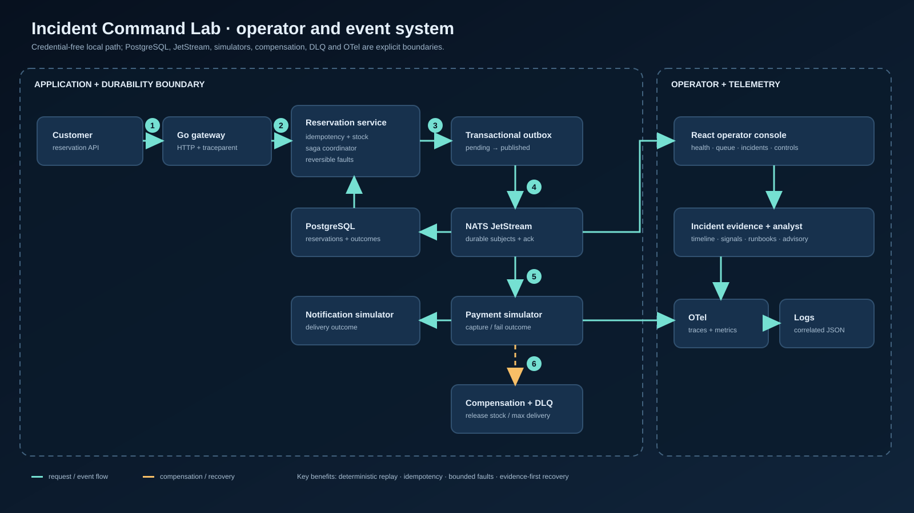
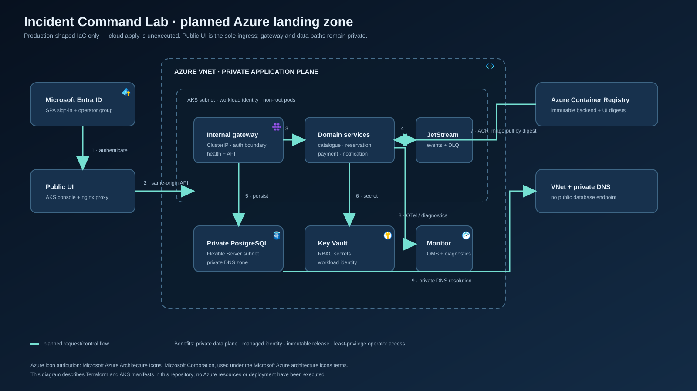
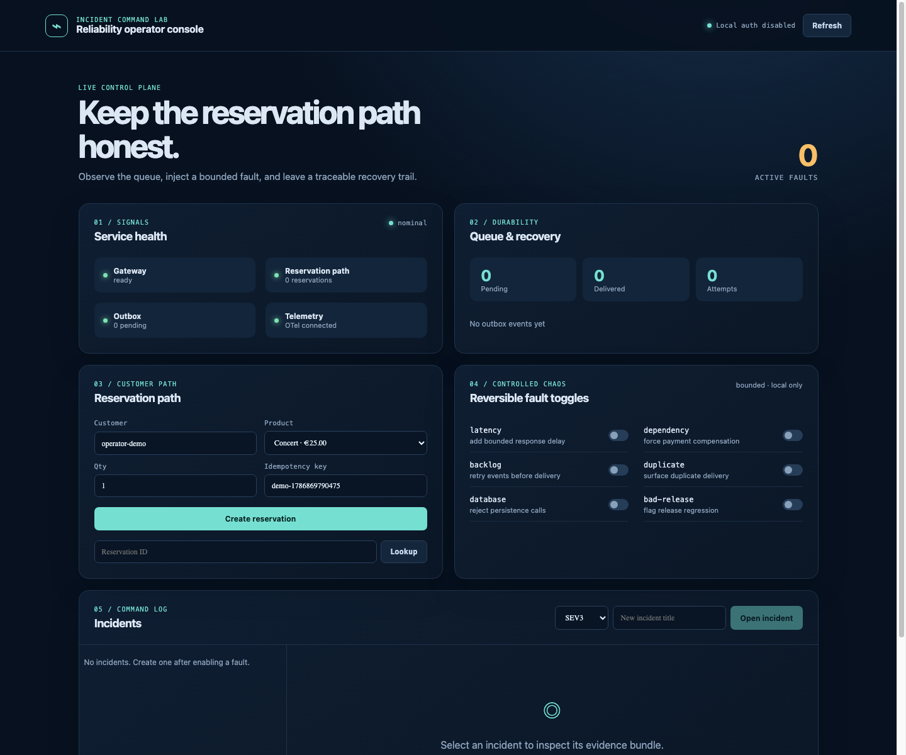

# Incident Command Lab

Incident Command Lab is an operator-facing reliability system for inspecting a fault-injectable ticket-reservation path. It combines a Go gateway, catalogue and reservation flow, payment and notification simulators, transactional-outbox-shaped events, idempotency, retries/DLQ simulation, compensation, telemetry, and a read-only incident evidence analyst.





> **Status:** Azure is not deployed; its resources are planned in Terraform and remain unexecuted. Local and CI evidence is not deployment evidence.

## Purpose and usefulness

Operational response is easier to inspect when failure, evidence, recovery, and limits are visible together. The console lets operators observe a reservation path, inject bounded faults, inspect an incident evidence bundle, and verify compensation without cloud credentials or production data.

This is an operator-facing reliability system, not a payment processor. Payments and notifications are simulations, and the Azure design is a separately gated target.

## Capabilities

- Idempotent reservations with bounded quantity and stock validation.
- Transactional-outbox-shaped state, JetStream retries, max-delivery/DLQ handling, and saga compensation.
- Reversible latency, dependency, backlog, duplicate, database, and bad-release faults.
- Incident timelines, signals, runbook references, trace correlation, and operator controls.
- Deterministic advisory analysis by default; optional Ollama/Azure adapters are read-only and fail back safely.
- Local in-memory mode plus Docker Compose PostgreSQL, NATS JetStream, OTel, Prometheus, Loki, Tempo, and Grafana services.
- Planned Azure AKS, ACR, PostgreSQL Flexible Server, Key Vault, managed identity, VNet, and monitoring resources.

## Architecture and security boundary

The Go gateway coordinates catalogue and reservation behavior. Durable Compose mode adds PostgreSQL for the reservation/idempotency/outbox transaction and NATS JetStream for event publication, retries, acknowledgements, and DLQ state. Payment and notification are simulators; dependency failure releases stock. The React console reads health, queue, reservation, fault, incident, evidence, analysis, and recovery surfaces.

The Azure diagram is a planned resource graph. Key Vault is provisioned with RBAC enabled but currently has no secrets, role assignments, or runtime consumption. Workload identity/OIDC/federation and service-account annotations are provisioned as infrastructure direction, but application consumption is incomplete. The current planned secret path for acceptance is workflow-created Kubernetes Secrets. There is intentionally no secret-flow arrow from Key Vault.

## Run locally

Requirements: Go 1.23+ or Docker. No credentials are needed.

```sh
go run ./cmd/gateway
curl http://localhost:8080/v1/catalogue
curl -X POST http://localhost:8080/v1/reservations \
  -H 'content-type: application/json' -H 'idempotency-key: demo-1' \
  -d '{"customer_id":"customer-1","product_id":"concert","quantity":2}'
```

For the full local operator and observability runtime:

```sh
docker compose up --build
# operator console: http://localhost:8080
# Grafana: http://localhost:3000 (localhost-only synthetic data)
```

Enable one fault, create an incident, inspect its evidence, and run advisory analysis. Local auth is explicitly disabled only for localhost. The browser-captured deterministic local view is shown below.



*Local mode, auth disabled, served from the checked-in UI build with deterministic synthetic operator-state JSON.*

## Deterministic advisory contract

`POST /ops/incidents/{id}/analyze` returns lower-case JSON fields: `summary`, `hypotheses`, `checks`, `advisory`, and `provider`. Each hypothesis is `{title, confidence, evidence}`; confidence is a number from `0` to `1`, and every evidence string must exactly equal an item from the incident `timeline`, `signals`, or `runbooks`. Remote Ollama/Azure output is strictly decoded and rejected when malformed, unknown, blank, unsafe, out of range, or uncited; the server then returns a `deterministic-fallback` advisory. Analysis never executes remediation.

## Verification and evidence

```sh
gofmt -d internal cmd
go test ./...
go test -race -cover ./...
go vet ./...
cd ui && npm ci && npm run typecheck && npm test && npm run build
cd .. && bash scripts/validate-repository.sh
```

CI has four enforced gates: `go`, `ui`, `repository-validation`, and `security`. Repository validation covers Compose, Terraform, shell, YAML, Markdown links, and SVG XML/unique IDs. Security runs full-history Gitleaks and a high/critical root-filesystem Trivy scan. Provenance/SBOM is release-workflow work only, not a pull-request CI claim. See the [evidence matrix](docs/evidence-matrix.md) for dated local checks and the authoritative prior hosted run.

## Exact deployment method: protected Azure delivery

The exact deployment method is the manually dispatched, protected workflow described in [`docs/development.md`](docs/development.md). `PLAN` initializes remote state and plans `terraform/azure`. `APPLY` runs Terraform and builds immutable backend/UI images in ACR. `SMOKE` obtains AKS credentials, creates the `database` and `operator-auth` Kubernetes Secrets from protected workflow inputs, resolves image digests, renders/applies manifests, runs migration and rollout checks, and performs a port-forwarded smoke. `DESTROY` removes the ephemeral resource group and verifies the state/output cleanup.

Azure apply, smoke, and destroy have not been executed for this repository state. Read the [deployment runbook](docs/runbooks/deploy.md), [security checklist](SECURITY.md), threat model, and [cost model](docs/cost-model.md) before any cloud action.

## Limitations and pre-deployment blockers

The in-memory runtime is single-process and not durable. Prometheus rules and Grafana configuration are configuration evidence, not measured SLO or error-budget evidence. Gateway and console containers have the documented non-root/read-only/capability controls; do not generalize those claims to every workload. The local anonymous Grafana viewer must not be exposed publicly.

Before cloud acceptance, complete and verify Key Vault/CSI integration, workload identity application consumption, full workload hardening, real metrics/SLO validation, recovery/restore evidence, secret rotation, private networking, and the complete protected Azure acceptance run. No Azure availability, production security posture, payment correctness, disaster recovery, or live monitoring claim is made here.

## API surface

Customer: `GET /v1/catalogue`, `POST /v1/reservations`, `GET /v1/reservations/{id}`, `POST /v1/reservations/{id}/cancel`.

Operator: `POST /ops/faults`, `GET /ops/state`, `POST /ops/incidents`, `GET /ops/incidents`, `GET /ops/incidents/{id}`, `GET /ops/incidents/{id}/evidence`, and `POST /ops/incidents/{id}/analyze`.

Every response includes W3C `traceparent` and `x-trace-id`. Cloud mode uses Microsoft Entra SPA MSAL and an operator-group gate; local mode is localhost-only and auth-disabled.

Azure Architecture Icons are used in the cloud diagram and attributed to the [official Microsoft Azure Architecture Icons resource](https://learn.microsoft.com/en-us/azure/architecture/icons/). Planned resources are labeled as such; no diagram element is deployment evidence.
