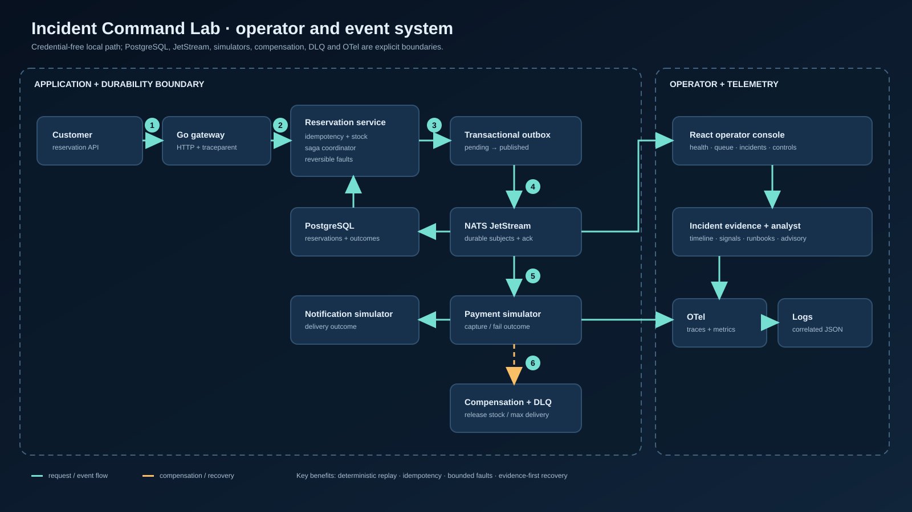
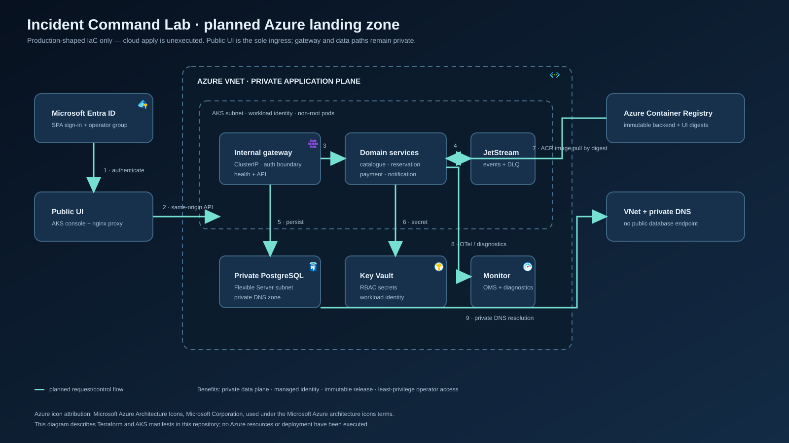
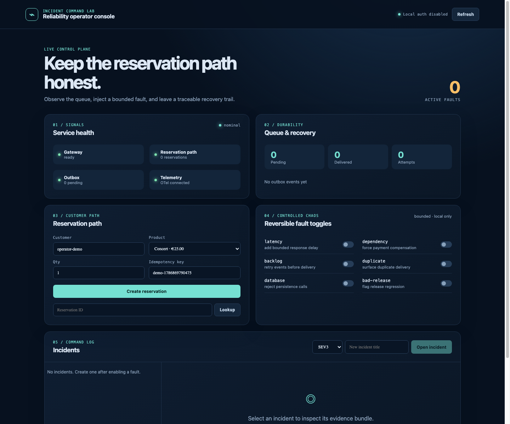

<!-- reader-first-readme:v1 -->

# Incident Command Lab

Incident Command Lab gives a reliability team a safe place to see how an online ticket reservation behaves when something goes wrong. Operators can create reservations, introduce controlled failures, inspect the resulting evidence, and confirm recovery from one browser-based console.

The payment and notification steps are simulations. The focus is the incident response experience: understanding failure, limiting damage, choosing a runbook, and verifying that service has recovered.

## What it does and why it is useful

The lab connects a realistic reservation workflow to reversible faults,
operational signals, incident evidence, and recovery checks. That gives teams a
repeatable way to inspect how failures spread and practice evidence-based
decisions without risking customers, production systems, or money.

## The 30-second overview

Imagine tickets for a concert are being reserved when the payment dependency stops responding:

1. An operator enables the dependency fault.
2. A customer-shaped request reserves two tickets.
3. Payment fails, so the system releases the reserved stock instead of leaving it unavailable.
4. The operator opens an incident and sees the failure timeline, service signals, queue state, and relevant runbook.
5. A read-only analyst suggests cited hypotheses and checks; it cannot execute a fix.
6. The operator disables the fault and verifies recovery.
7. Sending the same reservation request again cannot create an accidental duplicate.

The whole journey uses synthetic records and can run locally without cloud credentials.

## What people can do

### As an operator

- View service health, reservations, queue activity, and recent outcomes.
- Introduce and reverse latency, dependency, backlog, duplicate, database, and bad-release faults.
- Create an incident from the observed state.
- Inspect its timeline, signals, related runbooks, and trace identifiers.
- Request deterministic, evidence-cited analysis.
- Confirm compensation and recovery before closing the investigation.

### As a service developer

- Submit and cancel bounded ticket reservations.
- Repeat a request safely with an idempotency key—a client-provided identifier that prevents duplicate work.
- Exercise durable PostgreSQL and NATS behavior in Docker Compose.
- Follow requests across services through shared trace identifiers and local dashboards.

## A representative operator journey

Suppose an operator enables the `dependency` fault, then creates a reservation for two concert tickets. The gateway validates the request and reserves stock in the same database transaction that records an event waiting to be published. A payment simulator receives that event and fails deliberately. The compensation path releases the stock, while the notification simulator and observability tools record what happened.

The operator creates an incident in the console. Its evidence bundle contains only recorded timeline entries, service signals, and runbook references. The advisory analyst returns likely explanations and proposed checks, with each piece of evidence copied exactly from that bundle. It cannot change a deployment or disable a fault. The operator follows the linked dependency runbook, disables the fault, runs another request, and verifies the service and inventory state.

## Safety and trust boundaries

- Faults are explicit, bounded controls and can be reversed.
- Payments and notifications are simulations; no money moves and no message reaches a real customer.
- Reservation identifiers prevent retries from producing duplicate reservations.
- Database-backed reservation, stock, and outgoing-event changes succeed or fail together.
- Failed downstream processing has bounded retries and a dead-letter queue (DLQ), which isolates work that needs investigation.
- Incident analysis is advisory and read-only. It never executes remediation.
- Malformed, uncited, or unsafe remote-model output is discarded in favor of deterministic analysis.
- Local authentication is disabled only for localhost. The planned cloud mode requires Microsoft identity and an operator-group check.

## System architecture: from request to incident evidence



In plain language:

1. The operator console and customer-shaped requests enter through the Go gateway.
2. The catalogue supplies available products, while reservation state is stored in memory or PostgreSQL.
3. A transactional outbox records an outgoing event in the same transaction as the reservation. This prevents a successful reservation from losing its event.
4. NATS JetStream delivers events to the payment and notification simulators, with retries and a DLQ for repeated failures.
5. Dependency failure triggers compensation, which releases stock.
6. OpenTelemetry sends traces, metrics, and logs to the local observability stack for Grafana dashboards.
7. The incident service packages recorded evidence for the read-only analyst and the operator's decision.

## Technology guide in plain English

| Technology | Its job in this project |
| --- | --- |
| Go | Runs the gateway, catalogue, reservation, payment, and notification services. |
| React | Builds the operator console displayed in the browser. |
| PostgreSQL | Stores durable reservations, inventory, idempotency records, and outgoing events. |
| NATS JetStream | Delivers events between services and manages acknowledgement, retry, and failed-message state. |
| OpenTelemetry | Gives each request shared trace context and exports operational signals. |
| Prometheus, Loki, and Tempo | Store local metrics, logs, and traces respectively. |
| Grafana | Presents those signals in operator dashboards. |
| Docker Compose | Starts the complete durable local environment. |
| Terraform | Describes the planned Azure environment as reviewable code. |
| Kubernetes | Defines how the services would run as managed containers in Azure Kubernetes Service. |
| GitHub Actions | Repeats checks and provides separately protected cloud-delivery gates. |

## Azure cloud resources architecture

The cloud design moves the same service and operator flow into a managed Azure environment.



The diagram uses the [official Microsoft Azure Architecture Icons](https://learn.microsoft.com/en-us/azure/architecture/icons/). Source icon files are stored under `docs/diagrams/assets`, and the rendered diagram embeds them so it remains self-contained.

Microsoft Entra ID proves operator identity. Azure Kubernetes Service (AKS) runs the gateway, console, workers, messaging, and migration job; Azure Container Registry holds immutable images. Azure Database for PostgreSQL stores durable application state. A virtual network limits data-plane connections, managed identity supports passwordless Azure access, Azure Key Vault is reserved for secret management, and Azure Monitor receives cloud signals.

### Deployment status

The planned Azure resources have not been deployed. Terraform, Kubernetes manifests, and the protected workflow have been checked locally, but no Azure apply, authenticated smoke test, or destroy verification has run. Key Vault exists in the plan without stored secrets or application consumption; the current acceptance workflow creates Kubernetes secrets from protected inputs. Planned workload identity also needs application-level verification before it can be considered complete.

## What was tested

Recorded evidence covers:

- Go unit, server-authentication, race, coverage, and static-analysis checks.
- Reservation validation, idempotency, cancellation, event state, retries, dead-letter handling, and compensation.
- React type checking, component tests, and production builds.
- A clean Docker Compose browser journey covering dependency failure, compensation, incident evidence, analysis, fault removal, and recovery.
- PostgreSQL transactions and NATS JetStream publication and worker behavior.
- Terraform initialization and validation without deploying Azure resources.
- Compose, Kubernetes YAML, shell, Markdown-link, and diagram contracts.
- Full-history secret scanning and high/critical vulnerability scanning in continuous integration.

The [evidence matrix](docs/evidence-matrix.md) links claims to dated checks and separates local validation from cloud acceptance work.

## Important limitations

- The simplest in-memory server is single-process and loses its state when stopped.
- Payment and notification behavior is simulated and does not demonstrate financial correctness or delivery-provider integration.
- Configured dashboards and alert rules are not evidence of measured service objectives, error budgets, or live monitoring quality.
- Local Grafana allows anonymous viewing and must never be exposed publicly.
- Container hardening documented for the gateway and console should not be assumed for every workload.
- Azure identity, secret rotation, private networking, backup/restore, workload hardening, availability, and cost remain unverified until a full cloud acceptance cycle.
- The analyst provides suggestions, not root-cause proof; an incident commander remains responsible for decisions.

## Running the project locally

This section is for someone who wants to operate the system. A non-technical reader can stop here without missing the product explanation.

### Option 1: start the lightweight gateway

Install Go 1.25 or later, then run:

```sh
go run ./cmd/gateway
curl http://localhost:8080/v1/catalogue
curl -X POST http://localhost:8080/v1/reservations \
  -H 'content-type: application/json' \
  -H 'idempotency-key: demo-1' \
  -d '{"customer_id":"customer-1","product_id":"concert","quantity":2}'
```

This mode uses deterministic, in-memory components and needs no credentials.

### Option 2: start the complete operator environment

Install Docker with Docker Compose, then run from the repository folder:

```sh
docker compose up --build
```

Open the operator console at `http://localhost:8080` and Grafana at `http://localhost:3000`. Enable one fault, create a reservation and incident, inspect the evidence and advisory, then disable the fault and verify recovery.



Stop the environment with `Ctrl+C`, then:

```sh
docker compose down
```

## Checking the project

The full local check set requires Go 1.25, Node.js 20, Docker, Terraform, and the tools named by the validation script:

```sh
gofmt -d internal cmd
go test ./...
go test -race -cover ./...
go vet ./...
cd ui
npm ci
npm run typecheck
npm test
npm run build
cd ..
bash scripts/validate-repository.sh
```

## How to deploy using the protected Azure workflow

The exact deployment method is the manually dispatched **Cloud acceptance** GitHub Actions workflow. It uses GitHub's identity connection to Azure, an approved subscription, remote Terraform state, a protected `cloud-acceptance` environment, and protected identity/database inputs. Review the [deployment runbook](docs/runbooks/deploy.md), [security checklist](SECURITY.md), [threat model](docs/threat-model.md), and [cost model](docs/cost-model.md) before any cloud action.

Run the gates in order:

1. `plan` previews resources, permissions, images, and cost-sensitive changes.
2. `apply` requires `APPLY-APPROVED`, creates the Azure resources, and builds immutable backend and console images in Azure Container Registry.
3. `smoke` obtains AKS access, injects the protected runtime values, deploys manifests, runs the database migration, waits for each rollout, and executes a synthetic authenticated check through a local port-forward.
4. `destroy` requires `DESTROY-APPROVED`, removes the temporary resource group, and verifies its absence.

If a gate fails, preserve sanitized evidence and correct the configuration through a new plan instead of editing Terraform state manually. Exact ownership, acceptance criteria, rollback, and cleanup responsibilities are in the [protected Azure acceptance runbook](docs/runbooks/deploy.md).

## API surface

Customer-shaped requests use `GET /v1/catalogue`, `POST /v1/reservations`, `GET /v1/reservations/{id}`, and `POST /v1/reservations/{id}/cancel`.

Operator requests use `POST /ops/faults`, `GET /ops/state`, `POST /ops/incidents`, `GET /ops/incidents`, `GET /ops/incidents/{id}`, `GET /ops/incidents/{id}/evidence`, and `POST /ops/incidents/{id}/analyze`. Every response includes W3C `traceparent` and `x-trace-id` correlation values.

## Repository map

| Location | Contents |
| --- | --- |
| `cmd` | Separate Go entry points for the gateway and simulated services. |
| `internal` | Domain behavior, storage, messaging, analysis, authentication, and observability. |
| `ui` | React operator console and browser tests. |
| `deploy/otel` | Local metrics, logs, traces, dashboards, and alert configuration. |
| `deploy/aks` | Kubernetes application, worker, messaging, migration, and console manifests. |
| `terraform/azure` | Planned Azure resources and remote-state inputs. |
| `docs/diagrams` | System and Azure diagrams plus official icon source files. |
| `docs/runbooks` | Deployment and incident-response procedures. |
| `scripts` | Smoke, fault-drill, and repository-validation commands. |
| `.github/workflows` | Continuous integration, image release, and protected cloud acceptance. |

More detail is available in [development guidance](docs/development.md), [architecture decisions](docs/decisions/), and [contribution guidance](CONTRIBUTING.md).

Licensed under the MIT License.
